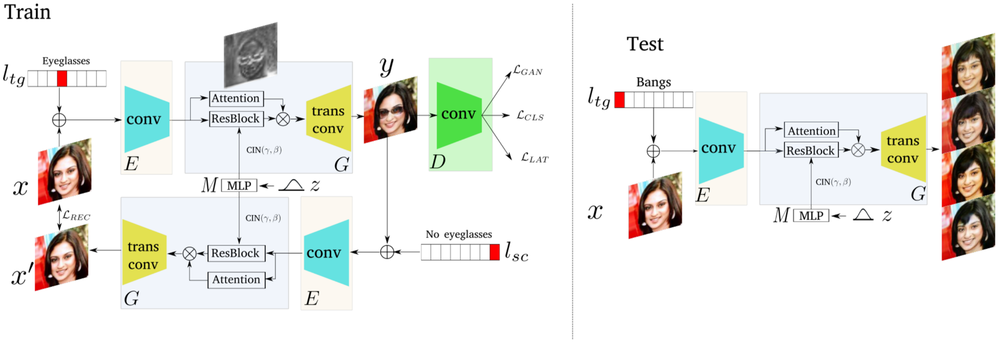

# SDIT-Tensorflow
## : Scalable and Diverse Cross-domain Image Translation (ACM-MM 2019)

<div align="center">
  
</div>

### [Paper](https://arxiv.org/abs/1908.06881) | [Official Pytorch code](https://github.com/yaxingwang/SDIT)

## Usage
```
├── dataset
   └── YOUR_DATASET_NAME
       ├── train
           ├── class1 (class folder)
               ├── xxx.jpg (class1 image)
               ├── yyy.png
               ├── ...
           ├── class2
               ├── aaa.jpg (class2 image)
               ├── bbb.png
               ├── ...
           ├── class3
           ├── ...
       ├── test
           ├── zzz.jpg (any content image)
           ├── www.png
           ├── ...

    └── celebA
           ├── train
               ├── 000001.png 
               ├── 000002.png
               └── ...
           ├── test
               ├── a.jpg (The test image that you wanted)
               ├── b.png
               └── ...
           ├── list_attr_celeba.txt (For attribute information) 
```

### Train
```
> python main.py --dataset flower
```

### Test
```
> python main.py --dataset flower --phase test


## Comparison
<div align="center">
  
</div>

## Our results
will be soon


## Author
[Junho Kim](http://bit.ly/jhkim_ai)
